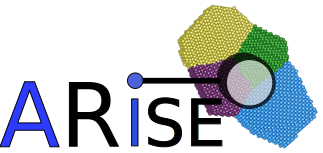

Welcome to ai4materials's README
========================================

ai4materials allows to perform complex analysis of materials science data using machine learning. It also
provide functions to pre-process (on parallel processors), save and subsequently load materials science datasets,
thus easing the traceability, reproducibility, and prototyping of new models.

An online documentation can be found here: https://ai4materials.readthedocs.io/en/latest/

Code authors: Angelo Ziletti, Ph.D. (angelo.ziletti@gmail.com), Andreas Leitherer (leitherer@fhi-berlin.mpg.de, andreas.leitherer@gmail.com)

## ARISE: Crystal-structure recognition via Bayesian deep learning
========================================================

ai4materials provides code for reproducing the results of 

    A. Leitherer, A. Ziletti, and L.M. Ghiringhelli,
    Robust recognition and exploratory analysis of crystal structures via Bayesian deep learning, arXiv:2103.09777 (2021)

Please cite this work if you use ai4materials in your research.

You can proceed with the installation steps as described below or directly proceed to a tutorial available at

    http://analytics-toolkit.nomad-coe.eu/tutorial-ARISE
    
within the NOMAD analytics toolkit (https://nomad-lab.eu/AItutorials) where you do not have to install any software.

------------------
### Installation
------------------

We recommend to create a virtual python 3.7 environment (for instance, with conda: https://docs.anaconda.com/anaconda/install/linux/), and then execute

    pip install 'git+https://github.com/angeloziletti/ai4materials.git'

To utilize the deep learning techniques introduced in A. Leitherer, A. Ziletti, and L.M. Ghiringhelli, 2021 (https://arxiv.org/abs/2103.09777), you need to install the quippy package (https://github.com/libAtoms/QUIP). This is necessary to compute the SOAP descriptor. 

The following commands to install QUIP have been tested for a python 3.7 environment created using conda 

Note that when executing make config, choose always the standard options, i.e., simply hit enter, execept when asked for compiling with GAP support, enter 'y'. Please check also for additional dependencies you may need to install, see also https://libatoms.github.io/GAP/installation.html):

    git clone --recursive https://github.com/libAtoms/QUIP.git
    cd QUIP/
    export QUIP_ARCH=linux_x86_64_gfortran
    make config
    make
    git submodule update --init --recursive
    pip install src/f90wrap
    make install-quippy

---------------
### ARISE - Usage
---------------

For global or local analysis of single- or polycrystalline systems, one just needs to define the corresponding geometry file and load a pretrained model for prediction:

    from ai4materials.models import ARISE

    geometry_files = [ file_1, file_2, ... ]

    predictions, uncertainty = ARISE.analyze(geometry_files, mode='global') 

    predictions, uncertainty = ARISE.analyze(geometry_files, mode='local',
                                              stride=[[4.0, 4.0, 4.0], ...], box_size=[12.0, ...])
                                              
Please refer to  http://analytics-toolkit.nomad-coe.eu/tutorial-ARISE and the associated publication for more details.
